# DevSecOps Pipeline — SecureBank

Security is integrated across the full development lifecycle — from static analysis at write time, to vulnerability scanning on every push, to real-time alerting in production. This document covers the tooling, findings, and design decisions.

---

## Pipeline Overview

```
Code commit
     │
     ├── GitHub Actions CI ──── Jest tests (38) + Trivy CVE scan
     │
     ├── Snyk ────────────────── Dependency + Docker image scanning (continuous)
     │
     ├── Arko ────────────────── SAST threat model + hackable score
     │
     └── n8n + Slack ─────────── Real-time security event alerting (production)
```

| Tool | Role |
|------|------|
| **GitHub Actions** | CI pipeline — automated tests and container scans on every push |
| **Trivy** | Docker image CVE scanning (CRITICAL/HIGH) |
| **Snyk** | Dependency and container scanning with automated fix PRs |
| **Arko** | AI-powered SAST — threat model, compliance mapping, hackable score |
| **n8n** | Workflow automation — routes security events from backend to Slack |
| **Slack** | Real-time security alert delivery with severity routing |

---

## CI Pipeline — GitHub Actions


Every push to `main` triggers two jobs running in parallel:

| Job | Steps |
|-----|-------|
| `test` | Checkout → Node 20 → `npm install` → `npm test` (38 Jest tests) |
| `scan` | Checkout → Build backend image → Build frontend image → Trivy scan both |

Trivy scans for CRITICAL and HIGH CVEs in both Docker images. The Snyk GitHub integration runs as a third check on all pull requests.

---

## SAST — Arko

Arko performed a static application security test against the full codebase, producing a threat model, compliance mapping, and a Hackable Score. Two scans were run — before and after remediation.

### Initial Scan — 59% Hackable Score


Two HIGH findings identified in `docker-compose.yml`:

| Finding | Detail | Risk |
|---------|--------|------|
| CORS origin misconfiguration | `CORS_ORIGIN` set to `http://localhost` — plaintext HTTP in production enables MitM interception of JWT tokens and cookies | HIGH |
| Secrets via env_file | `env_file: ./backend/.env` loads JWT keys, Plaid credentials, encryption key as plain env vars | HIGH |

### Threat Model & Compliance View


### Remediation

Both findings were addressed by removing hardcoded values from `docker-compose.yml` and replacing them with parameterised environment variables (`${CORS_ORIGIN}`, `${FRONTEND_URL}`) with no insecure defaults. This eliminates the hardcoded HTTP literal and ensures no credentials are baked into the Compose file.

### Post-Remediation Rescan — 48% Hackable Score


| Scan | Score | Findings | Outcome |
|------|-------|----------|---------|
| Initial | 59% Elevated Risk | 2 HIGH | Remediated |
| Post-fix | 48% | 4 infrastructure gaps | Accepted — documented as R-10, R-11 in `SECURITY.md` |

Remaining 4 findings are all infrastructure-level (HTTPS provisioning, secrets manager) — not application code defects. Accepted risks pending domain and TLS setup.

---

## Dependency & Container Scanning — Snyk

Snyk is integrated via GitHub and monitors 4 project targets continuously:

- `backend/package.json`
- `frontend/package.json`
- `backend/Dockerfile`
- `frontend/Dockerfile`

### Initial Scan

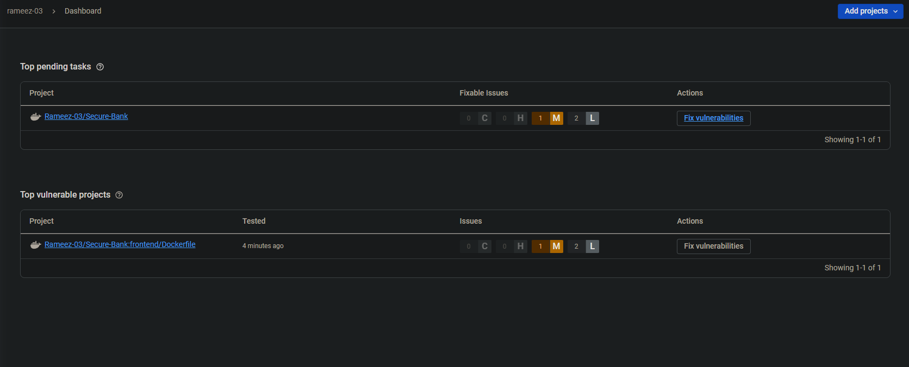

Three CVEs found in the `frontend/Dockerfile` — all in OS-level packages bundled with the `nginx:alpine` base image. No vulnerabilities in application dependencies or the backend image.

| Target | Findings | Detail |
|--------|----------|--------|
| `backend/Dockerfile` | 0 | `node:20-alpine` is up to date |
| `backend/package.json` | 0 | Clean |
| `frontend/package.json` | 0 | Clean |
| `frontend/Dockerfile` | 1 Medium, 2 Low | `xz/xz-libs` (heap overflow), `libxpm`, `nghttp2` |

### Automated Fix PR

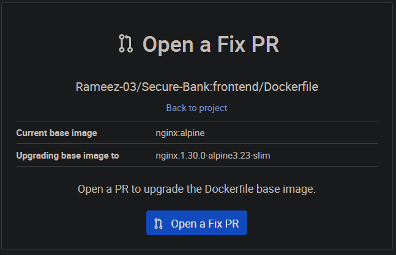

Snyk automatically opened a pull request to upgrade the base image from `nginx:alpine` to `nginx:1.30.0-alpine3.23-slim`. The PR triggered the full CI pipeline:

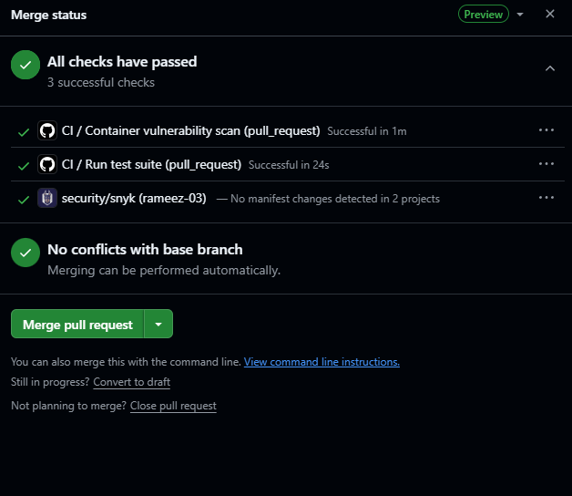

All 3 checks passed — Jest tests, Trivy scan, Snyk verification. PR merged into `main`.

### Post-Fix Rescan — 0 Vulnerabilities

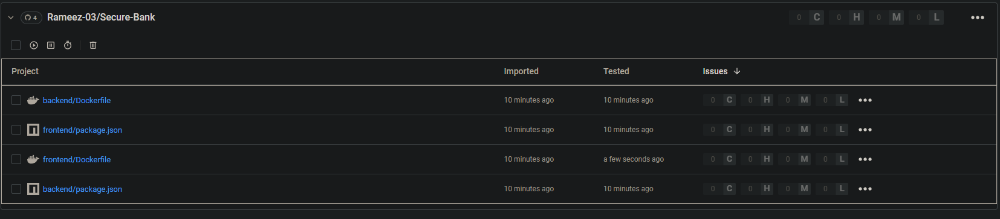

All 4 targets: **0 Critical / 0 High / 0 Medium / 0 Low**.

Full cycle: automated scan → CVE identification → fix PR → CI gate → merge → clean rescan — completed entirely within the pipeline with no manual intervention.

---

## Real-Time Security Alerting — n8n + Slack

Security events emitted by the backend are forwarded to an **n8n** automation workflow via webhook, which routes alerts to a dedicated **#security-alerts** Slack channel.

### Architecture

```
Backend event fires (e.g. login.account_locked)
     │
     ▼
sendAlert() — POST to n8n webhook (fire and forget, non-blocking)
     │
     ▼
n8n workflow — Webhook node → HTTP Request node
     │
     ▼
Slack Incoming Webhook → #security-alerts channel
```

### n8n Workflow

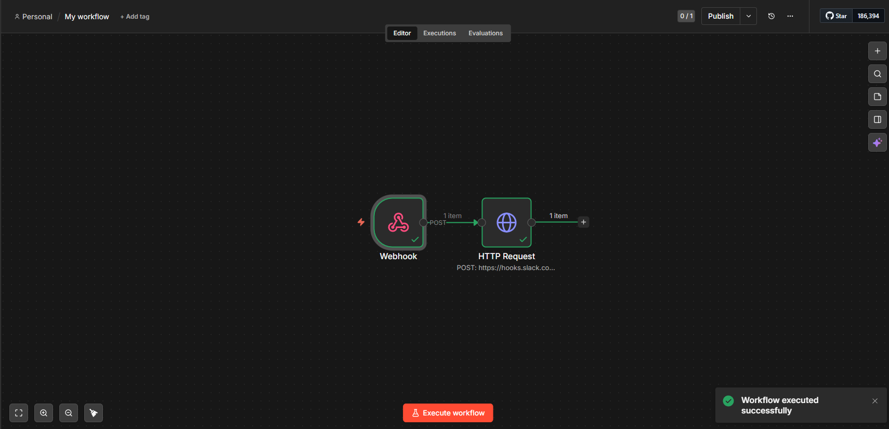

The workflow is two nodes: a **Webhook** trigger that receives POST requests from the backend, and an **HTTP Request** node that forwards the payload to the Slack Incoming Webhook URL.

### Alert Design — Solving Alert Fatigue

A naive implementation sends every security event to Slack. At any real scale this creates noise that gets ignored — which is as dangerous as no alerting at all. The alerting layer solves this with two controls:

**Severity routing** — events are classified into three tiers. LOW events (new registrations, bank account linked) are written to the Winston structured log only and never sent to Slack. Only MEDIUM and HIGH events reach the channel.

**Throttling** — MEDIUM events are throttled to one alert per 5 minutes per IP address. A brute force attempt sends one alert, not hundreds. HIGH events always bypass throttling and fire immediately every time.

| Severity | Behaviour | Examples |
|----------|-----------|---------|
| 🔴 HIGH | Immediate, every time, no throttle | Account locked, forged JWT, auth rate limit hit, account deleted |
| 🟡 MEDIUM | Once per 5 min per IP | Failed login, password reset, data export, bank unlinked |
| ⚪ LOW | Winston log only — no Slack alert | New registration, bank account linked |

### Events Monitored

| Event | Severity | Why It Matters |
|-------|----------|---------------|
| `login.account_locked` | HIGH | Brute force attack in progress |
| `auth.invalid_token` | HIGH | Forged or replayed JWT — active token attack |
| `rate_limit.auth` | HIGH | Automated attack against auth endpoints |
| `account.deleted` | HIGH | Permanent data destruction |
| `login.failed` | MEDIUM | Credential stuffing pattern indicator |
| `login.locked` | MEDIUM | Repeated attempt on a locked account |
| `password.reset.requested` | MEDIUM | Potential account takeover attempt |
| `password.reset.completed` | MEDIUM | Password changed via reset flow |
| `data.export` | MEDIUM | Full data export — data exfiltration risk |
| `plaid.bank_unlinked` | MEDIUM | Financial data access removed unexpectedly |
| `register.success` | LOW | New account created |
| `plaid.bank_linked` | LOW | Bank account connected |

### Alerts in Action

MEDIUM alert — login on locked account:

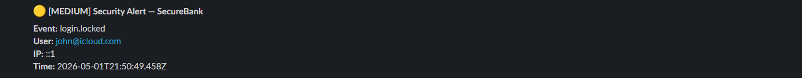

HIGH alert — account deleted:

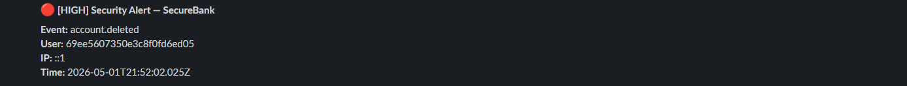

### Implementation

The alerting logic lives in `backend/src/utils/alert.js`. It is:
- **Non-blocking** — `fetch()` with no `await`, errors caught silently so a failed webhook never affects the user response
- **Opt-in** — if `N8N_WEBHOOK_URL` is not set, the function returns immediately with no side effects
- **Throttle state is in-memory** — resets on server restart, which is intentional (a fresh deploy clears stale throttle state)

---

## HTTPS Deployment — AWS EC2 + Let's Encrypt

### Objective

Deploy the application to production over HTTPS with a valid SSL certificate and automatic HTTP → HTTPS redirection. The Arko SAST scan had previously flagged the HTTP-only configuration as a residual risk (R-04, R-10). This phase closes both.

### Infrastructure

| Component | Detail |
|-----------|--------|
| Cloud provider | AWS EC2 — t3.micro, eu-west-2 (London) |
| Static IP | Elastic IP `35.176.189.75` — prevents IP change on instance restart |
| Domain | `securebankweb.duckdns.org` — free subdomain via DuckDNS, pointed at Elastic IP |
| TLS certificate | Let's Encrypt — free, 90-day auto-renewing certificate via Certbot |
| Port | 443 (HTTPS) added to EC2 security group inbound rules; port 80 redirects to 443 |

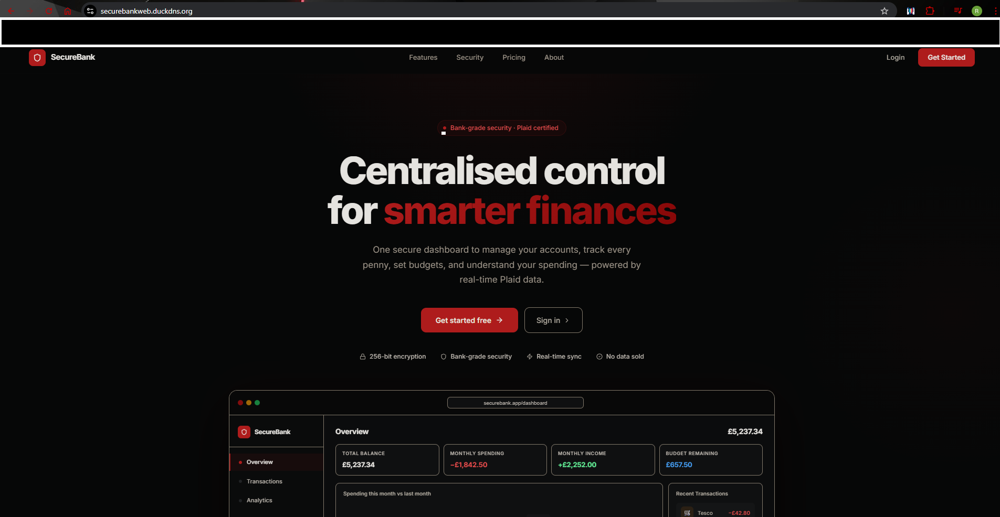
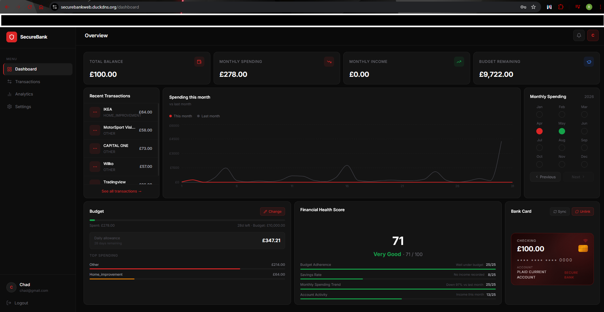
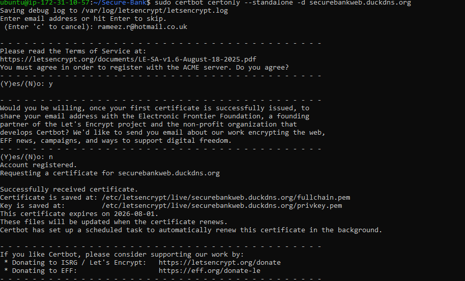

### Implementation

The nginx config was updated to handle two server blocks — one that redirects all HTTP traffic to HTTPS, and one that serves the app over TLS:

```nginx
# Redirect HTTP → HTTPS
server {
    listen 80;
    server_name securebankweb.duckdns.org;
    return 301 https://$host$request_uri;
}

server {
    listen 443 ssl;
    ssl_certificate     /etc/letsencrypt/live/securebankweb.duckdns.org/fullchain.pem;
    ssl_certificate_key /etc/letsencrypt/live/securebankweb.duckdns.org/privkey.pem;
    ssl_protocols       TLSv1.2 TLSv1.3;
    ...
}
```

`docker-compose.yml` was updated to expose port 443 and mount the Let's Encrypt certificate directory as a read-only volume into the nginx container:

```yaml
ports:
  - "80:80"
  - "443:443"
volumes:
  - /etc/letsencrypt:/etc/letsencrypt:ro
```

Certbot was installed on the EC2 host and used in standalone mode to obtain the certificate. Port 80 was briefly freed by stopping the frontend container, the certificate was issued, and the container was rebuilt with the updated HTTPS config.

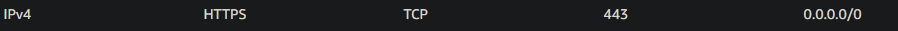
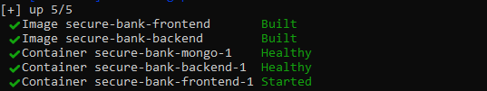

---

## Security Header Hardening — Mozilla Observatory

### Objective

After deploying HTTPS, the application's HTTP security headers were audited using Mozilla Observatory to identify any gaps in the browser-level security posture.

### Initial Scan — D (30/100)

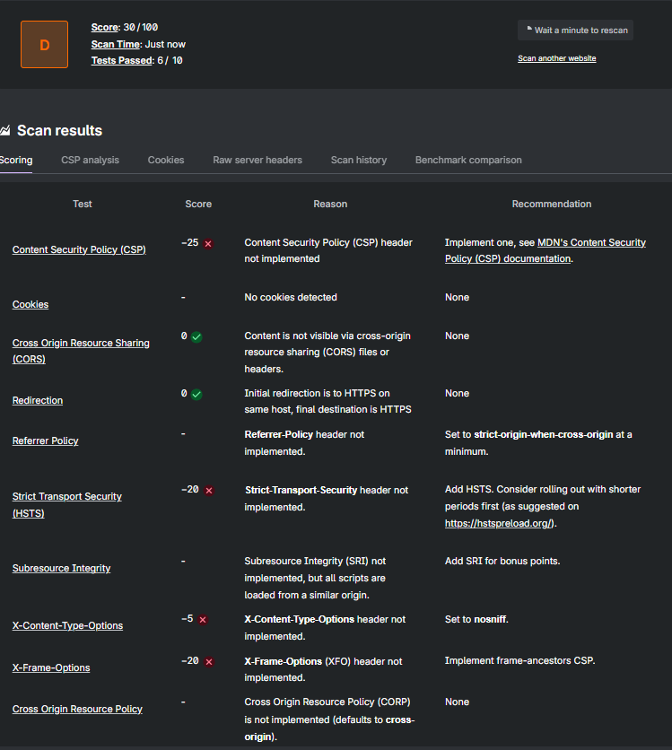

The initial scan returned a **D grade (30/100)** with 4 failing tests:

| Header | Score Impact | Issue |
|--------|-------------|-------|
| Content Security Policy (CSP) | −25 | Not implemented on nginx-served frontend |
| Strict-Transport-Security (HSTS) | −20 | Missing — browser not instructed to enforce HTTPS |
| X-Frame-Options | −20 | Missing — site embeddable in iframes (clickjacking risk) |
| X-Content-Type-Options | −5 | Missing — MIME-type sniffing not disabled |

**Root cause:** Helmet.js (which sets security headers) only applies to Express API responses. The React frontend is served directly by nginx, which had no header configuration. These two layers needed separate treatment.

### Remediation

All four missing headers were added to the nginx `server` block alongside a full Content Security Policy tailored to the application's requirements (Plaid CDN, self-hosted assets, Styled Components inline styles):

```nginx
add_header Strict-Transport-Security "max-age=31536000; includeSubDomains" always;
add_header X-Content-Type-Options "nosniff" always;
add_header X-Frame-Options "SAMEORIGIN" always;
add_header Referrer-Policy "strict-origin-when-cross-origin" always;
add_header Content-Security-Policy "default-src 'self'; script-src 'self' https://cdn.plaid.com; style-src 'self' 'unsafe-inline'; img-src 'self' data: https:; font-src 'self' data:; connect-src 'self' https://securebankweb.duckdns.org https://*.plaid.com; frame-src https://cdn.plaid.com; frame-ancestors 'none'; form-action 'self';" always;
server_tokens off;
```

**CSP design decisions:**
- `style-src 'unsafe-inline'` — required by Styled Components (CSS-in-JS generates inline styles at runtime; cannot use hashes)
- `https://*.plaid.com` wildcard in `connect-src` — Plaid uses multiple API subdomains; narrowing would break the bank link flow
- `frame-src https://cdn.plaid.com` — Plaid Link renders in an iframe served from Plaid's CDN
- `form-action 'self'` — prevents form submissions being redirected to external domains
- `server_tokens off` — suppresses nginx version from `Server` response header (removes version fingerprinting)

### Post-Fix Rescan — A+ (110/100)

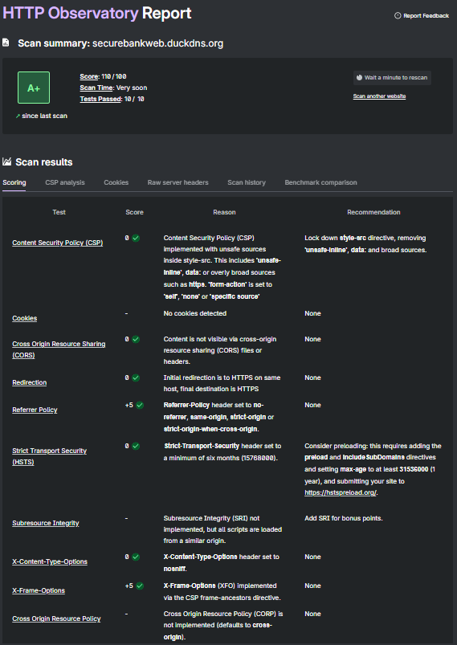

| Scan | Score | Grade | Tests Passed |
|------|-------|-------|-------------|
| Initial | 30/100 | D | 6/10 |
| Post-fix | 110/100 | **A+** | **10/10** |

All 10 tests passing. The CSP implementation alone contributed +25 to the score. The full header set now meets or exceeds Mozilla's recommended baseline.

### SSL Labs — TLS Configuration

SSL Labs was used to independently verify the TLS configuration, cipher suite strength, and certificate chain.

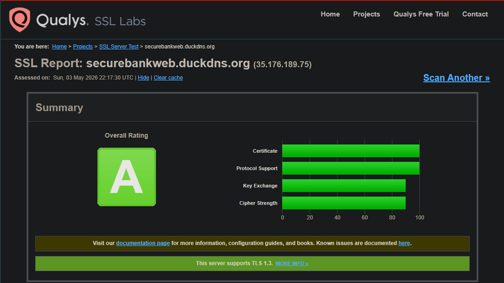

TLSv1.2 and TLSv1.3 are enforced; weak cipher suites are excluded; the Let's Encrypt certificate chain is valid and trusted.

---

## Penetration Testing — OWASP ZAP (2026-05-03)

### Objective

With the application live on HTTPS and all passive security controls in place, an automated penetration test was performed against the production deployment to actively probe for exploitable vulnerabilities — and to verify that the n8n + Slack alerting system responds to real attacks in real time.

### Tool

**OWASP ZAP** (Zed Attack Proxy) — industry-standard open-source DAST tool. Automated scan performed against `https://securebankweb.duckdns.org`.

ZAP ran two phases:
1. **Spider** — crawled all reachable pages and endpoints to build a site map
2. **Active Scan** — probed each discovered endpoint with attack payloads: SQL injection, XSS, path traversal, header injection, CSRF, server misconfiguration

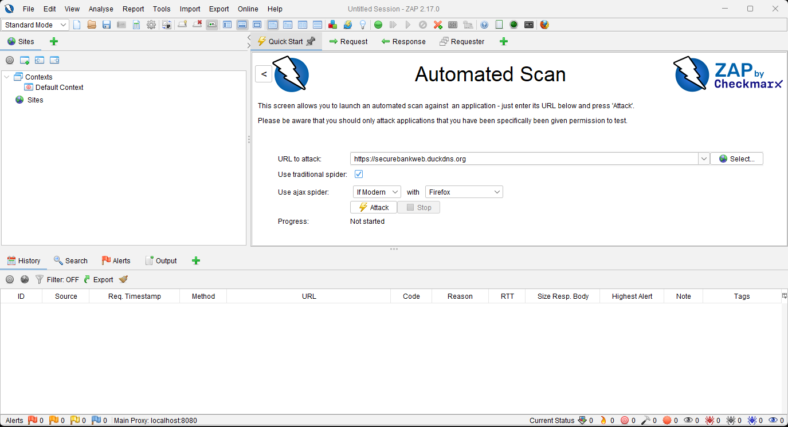
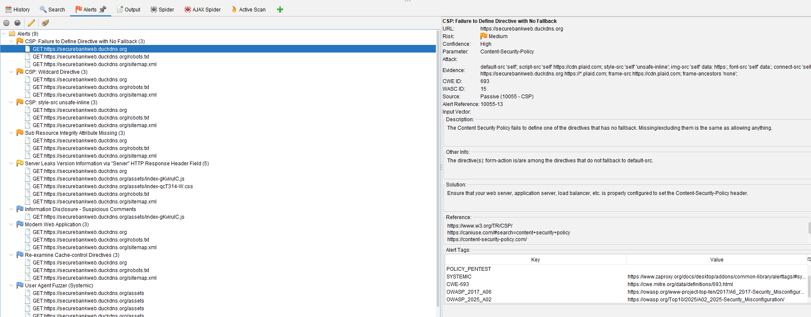

### Findings

**0 High / 0 Critical findings.** All application-layer attacks failed. The 9 alerts raised were all Medium, Low, or Informational:

| Finding | Risk | Assessment |
|---------|------|------------|
| CSP: Missing `form-action` directive | Medium | Fixed immediately — `form-action 'self'` added to CSP |
| CSP: Wildcard `*.plaid.com` in `connect-src` | Medium | Accepted — required for Plaid API multi-subdomain architecture |
| CSP: `unsafe-inline` in `style-src` | Medium | Accepted — required by Styled Components CSS-in-JS |
| Sub Resource Integrity (SRI) missing | Medium | Accepted — all scripts self-hosted; no third-party script integrity risk |
| Server leaks version via `Server` header | Low | Fixed immediately — `server_tokens off` added to nginx |
| Information disclosure (JS comments) | Low | Informational — build-time comments in bundled JS; no sensitive data |
| Cache-control headers | Low | Informational — static assets cached; acceptable for SPA |
| Modern Web Application detection | Informational | Expected — ZAP identifying React SPA |
| User-Agent fuzzing | Informational | No behaviour change on unusual User-Agent strings |

### Fixes Applied During Pen Test

Two findings were remediated immediately on discovery:

```nginx
# Added to CSP
form-action 'self';

# Added to nginx server block
server_tokens off;
```

### Live Alerting During Attack

With the alerting pipeline connected to the production deployment, the brute-force and rate-limit attacks triggered real-time Slack notifications during the pen test:


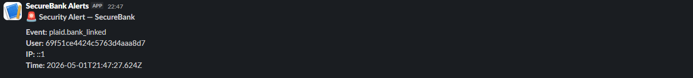

The alerts confirmed:
- `login.account_locked` HIGH fired after 5 consecutive failed login attempts
- `rate_limit.auth` HIGH fired when the auth endpoint was hammered in rapid succession
- Throttling worked correctly — MEDIUM events deduplicated per IP over the 5-minute window

### Assessment

The application withstood the automated pen test with no exploitable vulnerabilities found. The controls implemented across the hardening passes — IDOR scoping, injection sanitisation, rate limiting, JWT algorithm pinning, bcrypt hashing, httpOnly cookies — all held under active attack conditions.

| Attack | Result |
|--------|--------|
| SQL / NoSQL injection | ❌ Blocked — `express-mongo-sanitize` |
| Cross-Site Scripting (XSS) | ❌ Blocked — CSP + output encoding |
| Authentication bypass | ❌ Blocked — JWT algorithm pinning |
| IDOR (cross-user data access) | ❌ Blocked — `userId` scoping on all queries |
| Brute force | ❌ Blocked — rate limiter + account lockout; HIGH alert fired |
| Clickjacking | ❌ Blocked — `frame-ancestors 'none'` in CSP |
| HTTPS downgrade | ❌ Blocked — HSTS + HTTP → HTTPS redirect |
