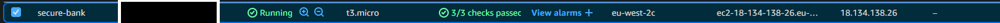
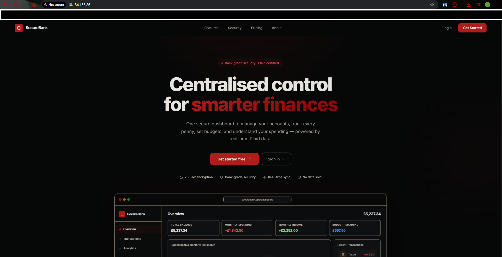
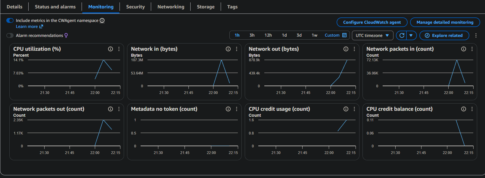

# SecureBank

A full-stack personal finance application built to demonstrate production-grade security engineering, GRC compliance, and a DevSecOps pipeline — not just a working app, but one built the way it would need to be built in a regulated, security-conscious environment.


---

## Purpose

Most portfolio projects demonstrate that software works. This one demonstrates that it was **built securely** — with a formal threat model, regulatory compliance framework, automated security tooling, and real-time incident alerting.

Key areas covered:

- **Application Security** — JWT session management, bcrypt, AES-256-GCM encryption, IDOR prevention, timing-safe auth, account lockout, rate limiting, security headers
- **Security Audit** — STRIDE threat model, OWASP Top 10 assessment, Likelihood × Impact risk register, residual risk documentation
- **GRC & Compliance** — Full UK GDPR / DPA 2018 implementation: ROPA, DPIA, Data Retention Policy, Breach Register, DPA Records, all six data subject rights
- **DevSecOps Pipeline** — SAST, dependency scanning, container scanning, CI/CD, real-time security alerting with severity routing and throttling
- **Cloud Deployment** — AWS EC2 (t3.micro, eu-west-2), Docker Compose, CloudWatch monitoring

---

## Tech Stack

| Layer | Technology |
|-------|-----------|
| **Frontend** | React 18, Vite, Styled Components, Recharts |
| **Backend** | Node.js, Express.js |
| **Database** | MongoDB (Atlas in production, containerised locally) |
| **Auth** | JWT (access token in-memory, refresh token in httpOnly cookie) |
| **Bank Integration** | Plaid API (sandbox) |
| **Encryption** | AES-256-GCM for Plaid tokens at rest |
| **Logging** | Winston (structured JSON audit log) |
| **Security Middleware** | Helmet, CORS, HPP, express-mongo-sanitize, express-rate-limit |
| **Containerisation** | Docker, Docker Compose, nginx (multi-stage build) |
| **SAST** | Arko |
| **Dependency & Container Scanning** | Snyk |
| **Container CVE Scanning** | Trivy (GitHub Actions) |
| **CI/CD** | GitHub Actions |
| **Security Alerting** | n8n + Slack |

---

## Architecture

```
Browser
   │
   ▼
nginx:80  ──── serves compiled React (dist/)
   │
   │  /api/* proxied to backend
   ▼
Express:5000  ──── REST API
   │
   ▼
MongoDB:27017  ──── persistent data (named Docker volume)
```

All three services run on a private Docker network. Only nginx (port 80) is exposed to the host. MongoDB and the backend are unreachable from outside the network.

---

## Features

- **Dashboard** — balance, monthly spending/income, budget tracking, financial health score, recent transactions, linked bank card widget
- **Transactions** — search and filter, manual CRUD, Plaid-synced transactions (read-only)
- **Analytics** — spending by category, monthly trend, top merchants
- **Settings** — profile management, password change, bank account link/unlink/sync, all GDPR data subject rights controls, account deletion
- **Bank Integration** — Plaid Link OAuth flow, cursor-based transaction sync, AES-256-GCM token encryption at rest
- **Financial Health Score** — automated 0–100 score from four weighted factors; disclosed as non-Article 22 automated decision

---

## Screenshots

### Dashboard


### Transactions


### Analytics


### Settings


### Authentication
 

---

## Docker Deployment


```bash
git clone https://github.com/Rameez-03/Secure-Bank.git
cd Secure-Bank
cp backend/.env.example backend/.env
# Fill in secrets — see .env.example for instructions
docker compose up --build
```

Open **http://localhost** in your browser.

| Container | Image | Role | Exposed |
|-----------|-------|------|---------|
| `frontend-1` | `nginx:1.30.0-alpine3.23-slim` | Serves React app, proxies `/api/*` | Port 80 |
| `backend-1` | `node:20-alpine` | Express REST API | Internal only |
| `mongo-1` | `mongo:7` | Database — persistent named volume | Internal only |

---

## AWS Deployment

Deployed to **AWS EC2** (t3.micro, eu-west-2) running the full Docker Compose stack on Ubuntu 24.04.





---

## Local Development

```bash
# Backend
cd backend && cp .env.example .env && npm install && npm run dev

# Frontend (separate terminal)
cd frontend && npm install && npm run dev
```

---

## Documentation

| Document | Description |
|----------|-------------|
| [`SECURITY.md`](SECURITY.md) | Security audit — STRIDE threat model, OWASP Top 10, Likelihood × Impact risk register (R-01 to R-11), Arko SAST findings, attestation |
| [`DEVSECOPS.md`](DEVSECOPS.md) | DevSecOps pipeline — CI/CD, Snyk scanning, Trivy, n8n + Slack real-time alerting |
| [`docs/COMPLIANCE.md`](docs/COMPLIANCE.md) | UK GDPR compliance audit — ROPA, Gap Register (C-01 to C-13), OWASP mapping, remediation plan |
| [`docs/DPIA.md`](docs/DPIA.md) | Article 35 Data Protection Impact Assessment |
| [`docs/DATA_RETENTION_POLICY.md`](docs/DATA_RETENTION_POLICY.md) | Retention schedule and deletion procedures |
| [`docs/BREACH_REGISTER.md`](docs/BREACH_REGISTER.md) | Article 33(5) breach register and 72-hour incident response procedure |
| [`docs/DPA_RECORDS.md`](docs/DPA_RECORDS.md) | Article 28 processor register — Plaid and SMTP |
| [`backend/.env.example`](backend/.env.example) | Environment variable reference |
