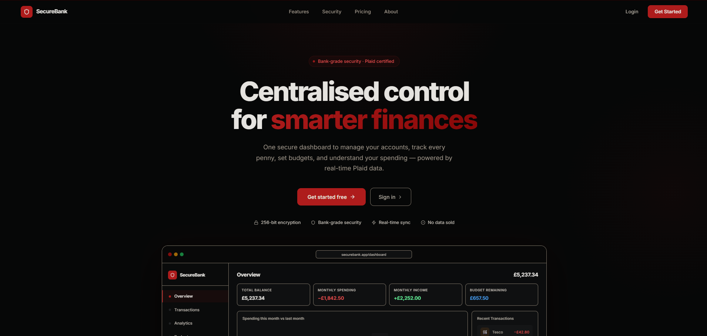
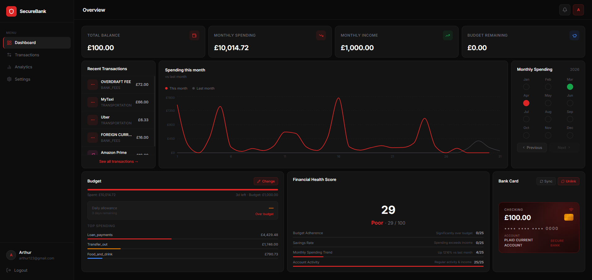
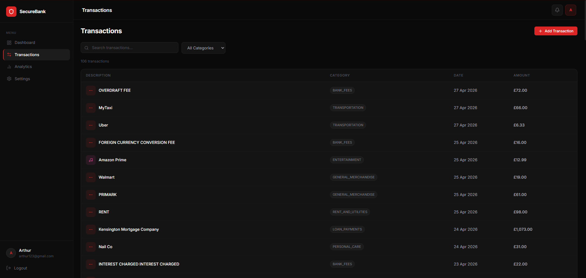
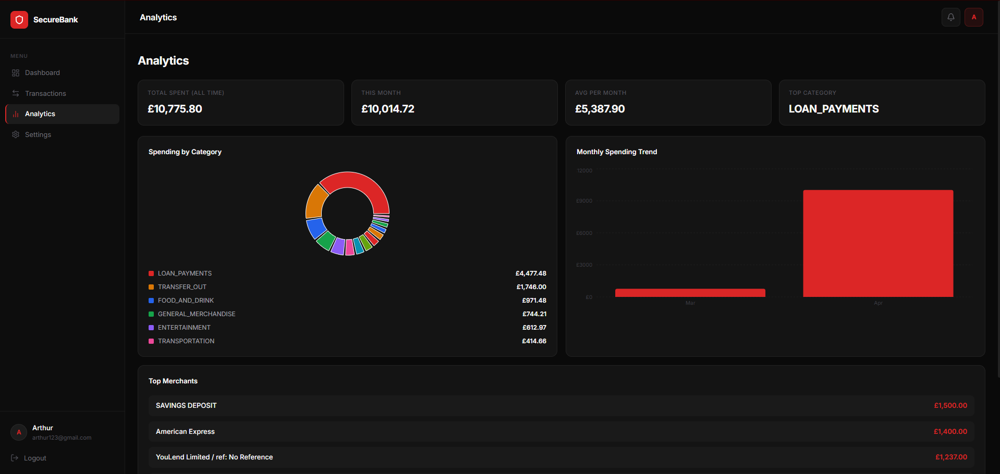
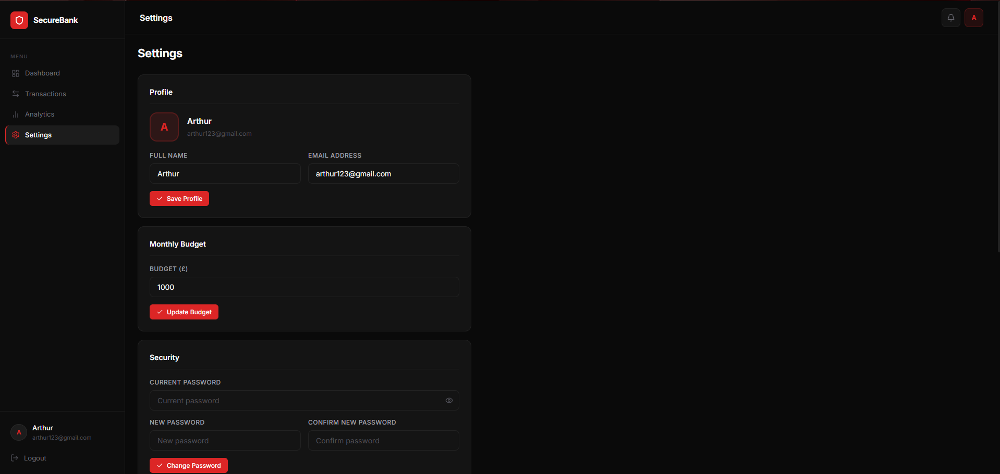
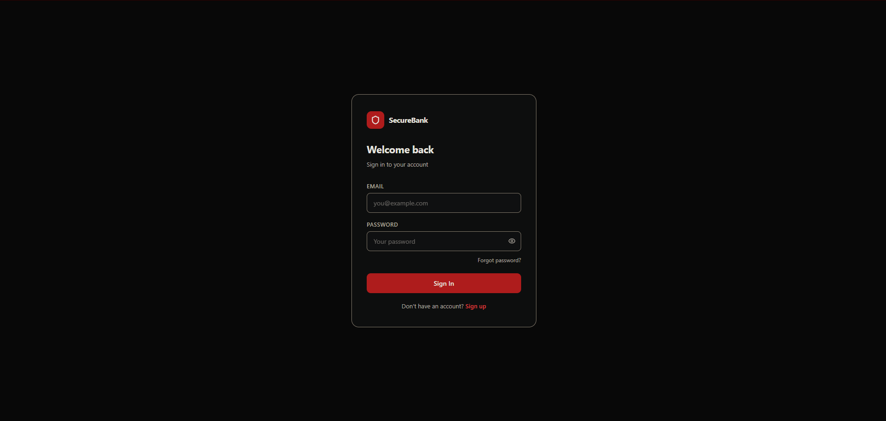
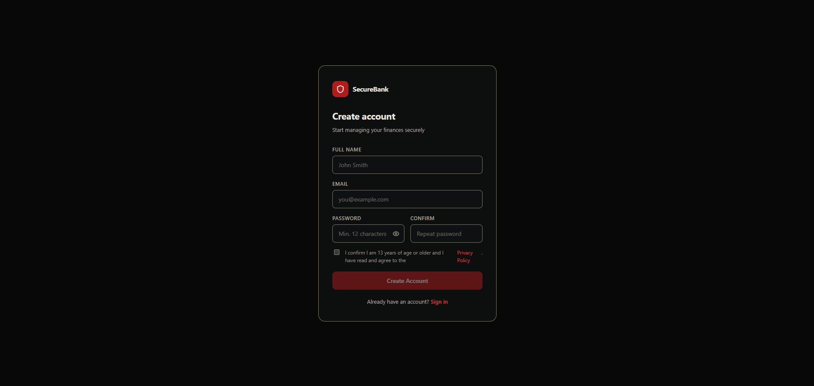
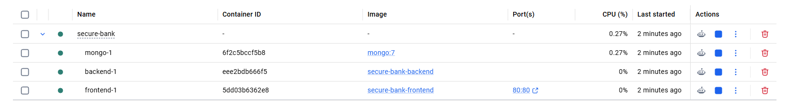

# SecureBank

A full-stack personal finance management application built with security and regulatory compliance as first-class concerns. Integrates with real bank accounts via Plaid, calculates automated financial health scores, and implements GDPR-compliant data handling throughout.



---

## Table of Contents

- [Overview](#overview)
- [Screenshots](#screenshots)
- [Tech Stack](#tech-stack)
- [Architecture](#architecture)
- [Features](#features)
- [Security](#security)
- [GDPR & Compliance](#gdpr--compliance)
- [Docker Deployment](#docker-deployment)
- [Local Development](#local-development)
- [Project Structure](#project-structure)
- [Documentation](#documentation)

---

## Overview

SecureBank was built to demonstrate production-grade engineering practices across the full stack — not just working software, but software built the way it would need to be built in a regulated, security-conscious environment.

The project goes beyond typical portfolio apps by incorporating:

- A formal security audit using the **STRIDE threat model** and **OWASP Top 10** framework, documented in `SECURITY.md`
- Full **UK GDPR / DPA 2018** compliance implementation with a Gap Register, ROPA, DPIA, Data Retention Policy, Breach Register, and DPA Records
- **Containerised deployment** via Docker with multi-stage builds, nginx reverse proxy, and health-checked service orchestration

---

## Screenshots

### Dashboard


### Transactions


### Analytics


### Settings


### Authentication
 

### Docker — All Three Containers Running


---

## Tech Stack

| Layer | Technology |
|-------|-----------|
| **Frontend** | React 18, Vite 8, Styled Components, Recharts, Lucide Icons |
| **Backend** | Node.js, Express.js |
| **Database** | MongoDB (Atlas in production, containerised locally) |
| **Auth** | JWT (access token in-memory, refresh token in httpOnly cookie) |
| **Bank Integration** | Plaid API (sandbox) |
| **Encryption** | AES-256-GCM for Plaid tokens at rest |
| **Logging** | Winston (structured JSON) |
| **Security Middleware** | Helmet, CORS, HPP, express-mongo-sanitize, express-rate-limit |
| **Containerisation** | Docker, Docker Compose, nginx |

---

## Architecture

```
Browser
   │
   ▼
nginx:80  ──── serves compiled React (dist/)
   │
   │  /api/* proxied to backend
   ▼
Express:5000  ──── REST API
   │
   ▼
MongoDB:27017  ──── persistent data (named Docker volume)
```

All three services run in isolated Docker containers on a private `app-network`. Only nginx (port 80) is exposed to the host. MongoDB and the backend are unreachable from outside the network.

---

## Features

### Core Application
- **Dashboard** — total balance, monthly spending/income, budget tracking, spending chart vs. last month, financial health score, recent transactions, linked bank card widget
- **Transactions** — full transaction list with search and category filter, manual transaction creation/editing/deletion, Plaid-synced transactions (read-only)
- **Analytics** — spending by category (donut chart), monthly spending trend, top merchants, aggregate stats
- **Settings** — profile management, password change, bank account link/unlink/sync, privacy & data controls, account deletion

### Bank Integration (Plaid)
- OAuth-style bank linking via Plaid Link
- Incremental transaction sync using Plaid's cursor-based API
- Account balance display
- Plaid access tokens encrypted at rest with AES-256-GCM before being stored in the database

### Financial Health Score
- Automated score (0–100) calculated from four weighted factors: Budget Adherence, Savings Rate, Monthly Spending Trend, Account Activity
- Disclosed as informational only — not a credit score, not an Article 22 automated decision

---

## Security

Security was assessed using the **STRIDE threat model** (Spoofing, Tampering, Repudiation, Information Disclosure, Denial of Service, Elevation of Privilege) and the **OWASP Top 10 2021** framework. Findings are documented in [`SECURITY.md`](SECURITY.md) with a full residual risk register.

### Authentication & Session Management
- Passwords hashed with **bcrypt (12 rounds)**
- JWT access tokens (15-minute TTL, stored in-memory only — never in localStorage)
- Refresh tokens in **httpOnly, Secure, SameSite cookies** (inaccessible to JavaScript)
- **Account lockout** after 5 failed login attempts — 15-minute lock tracked via `failedLoginAttempts` and `lockUntil` on the User model
- Timing-safe login — bcrypt always runs on both valid and non-existent accounts to prevent user enumeration via response timing
- Password reset tokens use 256-bit entropy, stored as SHA-256 hash only, single-use, expire after 1 hour

### Transport & Headers
- **Helmet.js** — sets CSP, X-Frame-Options, X-Content-Type-Options, HSTS (in production), and other security headers
- **CORS** — strict allowlist; credentials mode enabled for cookie forwarding
- **HPP** — prevents HTTP Parameter Pollution attacks
- **express-mongo-sanitize** — strips MongoDB operator injection from request body/query/params

### Rate Limiting
- Global limiter: 100 requests / 15 min / IP
- Auth endpoints: 20 requests / 15 min / IP
- Plaid sync: 100 requests / 15 min / IP

### Data Protection
- Plaid access tokens encrypted with **AES-256-GCM** before storage (`encrypt.js`) — raw token never persisted to database
- Sensitive fields (`password`, `accessToken`, `plaidCursor`, `failedLoginAttempts`, `lockUntil`) excluded from all API responses via `select: false`
- All transaction queries scoped to `req.user.userId` extracted from the verified JWT — never from request input (prevents IDOR)

### Structured Audit Logging
- **Winston** structured JSON logger replaces all `console.*` calls throughout the backend
- Every security-relevant event emits a structured log entry with `userId`, `ip`, `event`, and `timestamp`:
  - `login.success` / `login.failed` / `login.account_locked` / `login.locked`
  - `register.success`
  - `password.reset.requested` / `password.reset.completed`
  - `security.plaintext_token_detected`
  - `plaid.sync_complete` / `plaid.api_error`

---

## GDPR & Compliance

UK GDPR (DPA 2018) compliance was assessed and implemented across the application. All compliance work is documented in the files below.

| Document | Contents |
|----------|----------|
| [`COMPLIANCE.md`](COMPLIANCE.md) | Full compliance audit — UK GDPR article-by-article, OWASP Top 10, ROPA (7 processing activities), Gap Register (C-01 to C-13), remediation plan |
| [`SECURITY.md`](SECURITY.md) | Security audit — STRIDE threat model, risk scoring matrix (5×5 L×I), residual risk register (R-01 to R-09) |
| [`DPIA.md`](DPIA.md) | Article 35 Data Protection Impact Assessment — 8 risks identified and mitigated, processing approved |
| [`DATA_RETENTION_POLICY.md`](DATA_RETENTION_POLICY.md) | Retention schedule for all data categories, inactive account deletion process, legal holds clause |
| [`BREACH_REGISTER.md`](BREACH_REGISTER.md) | Article 33(5) breach register — 72-hour response procedure, risk classification guide, ICO notification checklist |
| [`DPA_RECORDS.md`](DPA_RECORDS.md) | Article 28 processor register — Plaid Inc. and SMTP provider records |

### Implemented Data Subject Rights

| Right | Article | Implementation |
|-------|---------|----------------|
| Right of Access | Art. 15 | `GET /api/users/:id/export` — returns full profile + all transactions as JSON |
| Right to Portability | Art. 20 | Same export endpoint — machine-readable JSON format |
| Right to Erasure | Art. 17 | Delete Account in Settings — removes all data + revokes Plaid access |
| Right to Rectification | Art. 16 | Profile update endpoint |
| Right to Restriction | Art. 18 | Restriction toggle in Settings — blocks all write operations and Plaid sync |
| Right to Object | Art. 21 | Documented in Privacy Policy |

### Additional Compliance Features
- **Privacy Policy** at `/privacy-policy` — all Article 13 disclosures, accessible without login
- **Age verification** checkbox on signup — submission blocked until confirmed (13+ requirement)
- **Cookie notice** — httpOnly refresh token disclosed as strictly necessary (PECR Regulation 6 exemption)
- **Health score disclosure** — methodology explained on Analytics page and in Privacy Policy; explicitly stated as non-Article 22 automated decision
- **`lastLoginAt` tracking** — enables inactive account management per the Data Retention Policy

---

## Docker Deployment

The entire stack (frontend, backend, database) runs in three containers orchestrated by Docker Compose.

### Prerequisites
- [Docker Desktop](https://www.docker.com/products/docker-desktop/)

### Run Locally

```bash
# 1. Clone the repository
git clone <repo-url>
cd secure-bank

# 2. Set up environment variables
cp backend/.env.example backend/.env
# Edit backend/.env and fill in your secrets (see .env.example for instructions)

# 3. Build and start all three containers
docker compose up --build
```

Open **http://localhost** in your browser.

```bash
# Start without rebuilding (subsequent runs)
docker compose up

# Stop
Ctrl+C

# Stop and wipe database
docker compose down -v
```

### Container Architecture

| Container | Image | Role | Exposed |
|-----------|-------|------|---------|
| `frontend-1` | `nginx:alpine` | Serves compiled React app, proxies `/api/*` to backend | Port 80 → host |
| `backend-1` | `node:20-alpine` | Express REST API | Internal only |
| `mongo-1` | `mongo:7` | Database with persistent named volume | Internal only |

**Key implementation details:**
- **Multi-stage frontend build** — Stage 1 (Node) compiles the Vite bundle; Stage 2 (nginx) serves only the `dist/` folder. Final image is ~25MB vs ~500MB with dev tooling.
- **nginx reverse proxy** — `VITE_API_URL=/api` is baked into the build; nginx routes `/api/` to the backend container. No CORS issues, single entry point.
- **`try_files $uri /index.html`** in nginx config ensures React Router works on direct navigation and page refresh.
- **Healthchecks + `condition: service_healthy`** — Compose waits for mongo to be ready before starting the backend, and for the backend before starting nginx. Prevents startup race conditions.
- **Named volume `mongo-data`** — data persists across `docker compose down`. Only `docker compose down -v` destroys it.

---

## Local Development

To run without Docker:

```bash
# Backend
cd backend
cp .env.example .env    # fill in values
npm install
npm run dev             # starts on port 5001

# Frontend (separate terminal)
cd frontend
npm install
npm run dev             # starts on port 3000

---

## Project Structure

```
secure-bank/
├── backend/
│   ├── src/
│   │   ├── controllers/        # authController, transactionController,
│   │   │                       # healthScoreController, plaidController
│   │   ├── middleware/         # authMiddleware (JWT), rateLimiter
│   │   ├── models/             # userModel, transactionModel
│   │   ├── routes/             # authRoutes, userRoutes,
│   │   │                       # transactionRoutes, plaidRoutes
│   │   ├── utils/              # logger (Winston), encrypt (AES-256-GCM),
│   │   │                       # email (nodemailer)
│   │   └── server.js           # Express app, security middleware, startup
│   ├── .env.example
│   ├── Dockerfile
│   └── package.json
├── frontend/
│   ├── src/
│   │   ├── components/
│   │   │   ├── common/         # Button, Input, LoadingSpinner, ErrorBoundary
│   │   │   ├── dashboard/      # widgets (BankCard, Budget, HealthScore,
│   │   │   │                   # MonthlySpending, RecentTransactions, Streaks)
│   │   │   └── layout/         # Header, Sidebar, Layout
│   │   ├── context/            # AuthContext, AuthReducer
│   │   ├── hooks/              # useTransactions
│   │   ├── pages/              # Dashboard, Transactions, Analytics,
│   │   │                       # Settings, Landing, Signin, Signup,
│   │   │                       # ForgotPassword, ResetPassword, PrivacyPolicy
│   │   ├── services/           # api.jsx (Axios instance + all API calls)
│   │   ├── styles/             # theme.js
│   │   └── utils/              # validators.js
│   ├── nginx.conf
│   ├── Dockerfile
│   └── package.json
├── docs/
│   └── screenshots/
├── docker-compose.yml
├── SECURITY.md                 # STRIDE threat model + residual risk register
├── COMPLIANCE.md               # UK GDPR compliance audit + gap register
├── DPIA.md                     # Article 35 Data Protection Impact Assessment
├── DATA_RETENTION_POLICY.md    # Retention schedule + deletion procedures
├── BREACH_REGISTER.md          # Article 33(5) breach register + response procedure
└── DPA_RECORDS.md              # Article 28 processor register (Plaid, SMTP)
```

---

## Documentation

| File | Description |
|------|-------------|
| [`SECURITY.md`](SECURITY.md) | Full security audit — STRIDE, OWASP Top 10, risk register |
| [`COMPLIANCE.md`](COMPLIANCE.md) | UK GDPR compliance audit — ROPA, gap register, remediation plan |
| [`DPIA.md`](DPIA.md) | Data Protection Impact Assessment (ICO template) |
| [`DATA_RETENTION_POLICY.md`](DATA_RETENTION_POLICY.md) | Data retention schedule and deletion procedures |
| [`BREACH_REGISTER.md`](BREACH_REGISTER.md) | Personal data breach register and incident response procedure |
| [`DPA_RECORDS.md`](DPA_RECORDS.md) | Data Processing Agreement records for third-party processors |
| [`backend/.env.example`](backend/.env.example) | Environment variable reference |
