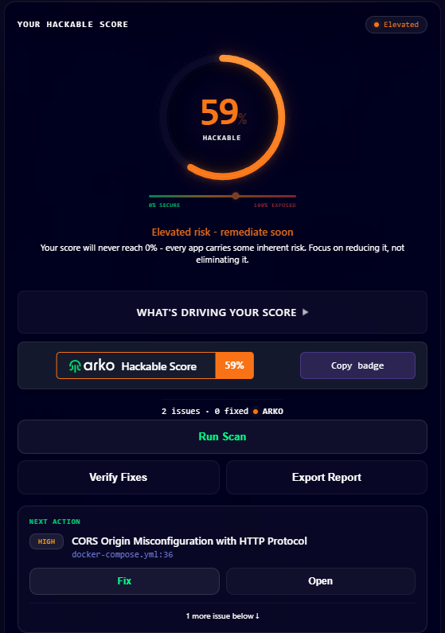
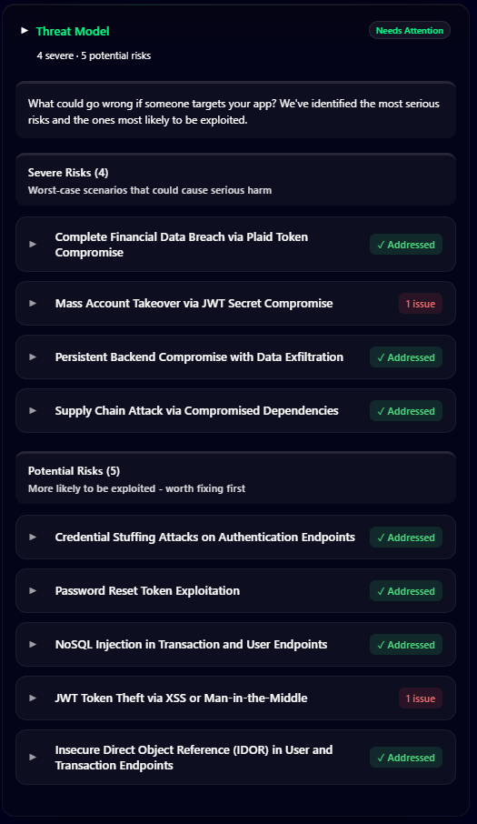
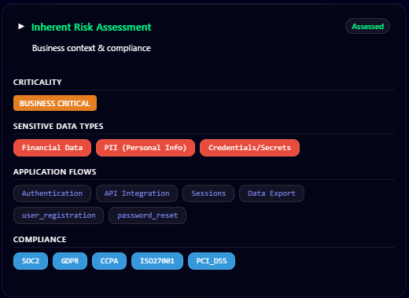
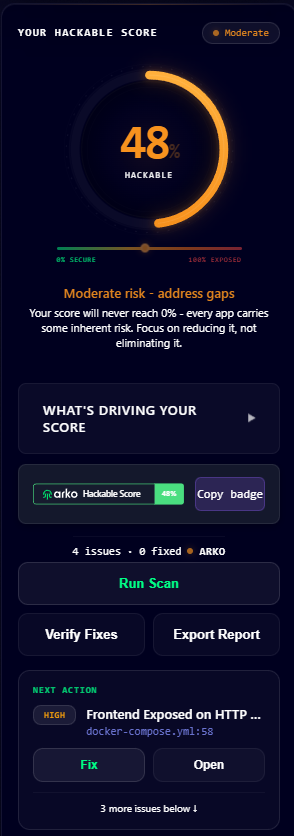
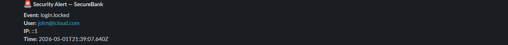

# Security Audit Report — Secure Bank

**Classification:** Internal — Restricted  
**Project:** Secure Bank (full-stack personal finance application)  
**Audit Type:** White-box code review (self-assessment)  
**Assessment Date:** 2026-04-26  
**Auditor:** Rameez (developer)  
**Report Status:** Active — hardening complete, residual risks documented

---

## Document Control

| Version | Date | Summary |
|---------|------|---------|
| 1.0 | 2026-04-26 | Initial audit baseline and Hardening Pass 1 |
| 1.1 | 2026-04-26 | Fix Pass 2 — Plaid regression and vulnerability remediation |
| 1.2 | 2026-04-26 | Fix Pass 3 — deep controller, model, and frontend review |
| 1.3 | 2026-04-26 | Fix Pass 4 — password change and reset implementation |
| 2.0 | 2026-04-26 | Restructured to full audit standard: scope, asset inventory, threat model, risk scoring methodology, residual risk register, attestation |
| 2.1 | 2026-04-28 | Automated SAST scan via Arko — 2 findings identified, documented as R-10 and R-11 |
| 2.2 | 2026-04-30 | Snyk scanning added — findings moved to DEVSECOPS.md; cross-reference added to §15 |
| 2.3 | 2026-05-04 | HTTPS deployed on AWS EC2 (Let's Encrypt, DuckDNS); pen test performed (OWASP ZAP); R-04 and R-10 closed; pen test findings documented in §15 |

---

## 1. Scope & Methodology

### 1.1 In Scope

| Component | Description |
|-----------|-------------|
| Express.js backend | All routes, middleware, controllers, models (`/backend/src/`) |
| React frontend | All pages, hooks, context, API service (`/frontend/src/`) |
| Authentication system | Registration, login, logout, token management, password reset |
| Data models | MongoDB schemas and validation (`userModel.js`, `transactionModel.js`) |
| Plaid integration | Token exchange, balance fetch, transaction sync, unlink |
| npm dependency chain | Backend and frontend package audits (`npm audit`) |
| Configuration | `.env.example`, server bootstrap, middleware ordering |

### 1.2 Out of Scope

| Component | Reason Excluded |
|-----------|----------------|
| Plaid infrastructure | Plaid holds its own compliance certifications; their API security is outside this project's control |
| MongoDB Atlas infrastructure | Atlas holds SOC 2 Type II; infrastructure-level DB security is out of scope |
| Hosting / network layer | Application not yet deployed; to be assessed separately at deployment using CIS Benchmarks |
| Physical security | Not applicable to a cloud-hosted web application |
| Third-party CDN / DNS | Outside project control |

### 1.3 Testing Approach

**Type:** White-box (full source code access)  
**Method:** Manual static code review assisted by `npm audit`; automated SAST via Arko (2026-04-28)  
**Coverage:** All backend controllers, middleware, models, and routes; all frontend pages, hooks, and services  
**Dynamic testing:** OWASP ZAP automated penetration test performed against live HTTPS deployment `https://securebankweb.duckdns.org` (2026-05-03). 0 High/Critical findings. Full results in §15.

### 1.4 Standards Referenced

| Standard | Version | Role in This Audit |
|----------|---------|-------------------|
| NIST Cybersecurity Framework (CSF) | 2.0 | Report structure (Identify → Protect → Detect → Respond → Recover) |
| OWASP Application Security Verification Standard (ASVS) | 4.0 | Code-level control checklist |
| OWASP Top 10 | 2021 | Common vulnerability classification reference |
| UK GDPR | 2018 (as amended post-Brexit) | Privacy and data protection — covered in COMPLIANCE.md |

---

## 2. Risk Scoring Methodology

All findings are scored using a **Likelihood × Impact** matrix on independent 1–5 scales, producing a composite risk score of 1–25. Scores determine remediation priority independently of subjective severity labels.

### Likelihood Scale

| Score | Label | Description |
|-------|-------|-------------|
| 1 | Rare | Requires highly specific conditions; unlikely to occur in practice |
| 2 | Unlikely | Possible but requires elevated skill or privileged access beyond a typical attacker |
| 3 | Possible | Could occur; requires some effort or opportunistic conditions |
| 4 | Likely | Expected to occur; low-effort or automated exploitation is feasible |
| 5 | Almost Certain | Trivially exploitable or commonly attempted at scale without specific targeting |

### Impact Scale

| Score | Label | Description |
|-------|-------|-------------|
| 1 | Negligible | No material harm; cosmetic or purely theoretical consequence |
| 2 | Minor | Limited exposure; easily contained with no lasting harm |
| 3 | Moderate | Partial data exposure, degraded service, or reputational harm |
| 4 | Major | Significant data breach, financial loss, or session compromise |
| 5 | Critical | Full system compromise, mass data exposure, or financial fraud enabled |

### Risk Bands

| Score | Rating | Required Action |
|-------|--------|----------------|
| 20–25 | **Critical** | Block release; remediate before any further deployment |
| 13–19 | **High** | Remediate immediately — do not carry into next sprint |
| 6–12 | **Medium** | Remediate within current sprint |
| 1–5 | **Low** | Accept or schedule for backlog |

---

## 3. Asset Inventory

All assets are classified by sensitivity and the harm that would result from unauthorised disclosure or modification.

| Asset | Type | Classification | Storage Location | Notes |
|-------|------|---------------|-----------------|-------|
| User credentials (email + hashed password) | PII + Auth | **Restricted** | MongoDB | bcrypt 12 rounds; never returned in API responses |
| User profile (name, email) | PII | **Confidential** | MongoDB | Returned to authenticated owner only |
| Financial transaction records | Financial PII | **Restricted** | MongoDB | Scoped to `userId`; paginated; Plaid-synced records are read-only |
| Plaid access tokens | Third-party secrets | **Restricted** | MongoDB (AES-256-GCM encrypted) | Grants read access to linked bank account |
| JWT access tokens | Session tokens | **Restricted** | Browser JS memory only | 15-min TTL; never written to any storage |
| JWT refresh tokens | Session tokens | **Restricted** | httpOnly cookie only | 7-day TTL; path-scoped to `/api/auth`; inaccessible to JavaScript |
| Password reset tokens (SHA-256 hashed) | Single-use secrets | **Restricted** | MongoDB | Only the hash is stored; raw token sent in email; 1-hr expiry |
| Application source code | Intellectual property | **Internal** | Git repository | |
| Environment secrets (JWT_SECRET, ENCRYPTION_KEY, SMTP credentials) | Infrastructure secrets | **Restricted** | Server environment (`.env`) | Server exits on startup if mandatory variables are absent |
| MongoDB connection string | Infrastructure secrets | **Restricted** | Server environment (`.env`) | Server exits on startup if absent |

---

## 4. Threat Model (STRIDE)

Threats are identified using the STRIDE methodology applied to each asset category. Each threat maps to its current mitigation status.

### 4.1 Spoofing — Identity Attacks

| Threat | Targeted Asset | Mitigation | Status |
|--------|---------------|------------|--------|
| Brute-force login to assume another user's identity | User credentials | `authLimiter` (30 req / 15 min / IP); bcrypt 12 rounds | ✅ Mitigated |
| Forged JWT access token to bypass authentication | User session | HS256 algorithm pinned; `JWT_SECRET` validated at startup; server exits if absent | ✅ Mitigated |
| Spoofed password reset token to hijack an account | Account recovery | 32-byte random token (256-bit entropy); SHA-256 hash-on-store; 1-hr expiry; single-use `$unset` | ✅ Mitigated |
| Spoofed `X-Forwarded-For` header to evade IP rate limiting | Rate limiter | `trust proxy` only set in production; dev traffic uses real source IP | ✅ Mitigated |
| Credential stuffing using breached email/password pairs | User credentials | Rate limiting on auth endpoints; account lockout after 5 failures (15-min lock); strong 12-char+ password policy | ✅ Mitigated |

### 4.2 Tampering — Data Integrity Attacks

| Threat | Targeted Asset | Mitigation | Status |
|--------|---------------|------------|--------|
| MongoDB operator injection (`$where`, `$gt`) via request body | Database | `express-mongo-sanitize` strips `$` and `.` from all incoming request data | ✅ Mitigated |
| Edit bank-synced transactions to inflate health score | Transaction integrity | `isManual` guard — Plaid-synced transactions return 403 on any update attempt | ✅ Mitigated |
| Submit `NaN`, `Infinity`, or out-of-range `amount` to corrupt calculations | Financial data | `Number.isFinite()` check + ±1 billion range validation in controller and model | ✅ Mitigated |
| HTTP Parameter Pollution to override or duplicate query parameters | API layer | `hpp` middleware on all routes | ✅ Mitigated |
| Oversized string payloads to exhaust MongoDB document storage | Database | `maxlength` on all string fields; global 10 KB body limit | ✅ Mitigated |

### 4.3 Repudiation — Audit Trail Gaps

| Threat | Targeted Asset | Mitigation | Status |
|--------|---------------|------------|--------|
| User denies initiating a transaction; no server record to dispute the claim | Audit trail | Winston structured JSON logger (`logger.js`) records auth events with userId + IP | ✅ Mitigated — R-03 |
| Privileged or destructive action performed with no attribution record | Audit trail | Winston replaces all `console.*` in authController — login, logout, register, password reset all emit structured events | ✅ Mitigated — R-03 |

### 4.4 Information Disclosure — Data Exposure

| Threat | Targeted Asset | Mitigation | Status |
|--------|---------------|------------|--------|
| Database breach exposes plaintext Plaid access tokens | Plaid tokens | AES-256-GCM encryption at rest via `encrypt.js` | ✅ Mitigated |
| Stack trace or JWT secret leaked via 500 error response | Internal config | Production error handler returns generic message only; no stack trace | ✅ Mitigated |
| User enumeration via login response timing (known vs unknown email) | User existence | Timing-safe dummy bcrypt hash (valid 60-char hash, 12 rounds) runs on all unknown-email paths | ✅ Mitigated |
| User enumeration via forgot-password response | User existence | Always returns identical `200` response regardless of whether email is registered | ✅ Mitigated |
| Full Plaid internal error objects returned to client | Internal config | `isProd` check — detail logged server-side only; generic response in production | ✅ Mitigated |
| `plaidItemId` / `plaidCursor` exposed in user API responses | Internal data | Stripped in `toJSON()` transform on User model | ✅ Mitigated |
| Password hash returned in API response | Credentials | `toJSON()` strips `password`; `select: false` on all sensitive schema fields | ✅ Mitigated |
| Refresh token interceptable by JavaScript or XSS payload | Session token | Stored in httpOnly cookie — inaccessible to JavaScript by browser specification | ✅ Mitigated |
| Access token persisted to localStorage and readable after session ends | Session token | Access token stored in JS memory only; never written to any persistent storage | ✅ Mitigated |

### 4.5 Denial of Service

| Threat | Targeted Asset | Mitigation | Status |
|--------|---------------|------------|--------|
| High-volume unauthenticated requests to exhaust server resources | Server availability | Global rate limiter (500 req / 15 min / IP in production) | ✅ Mitigated |
| Oversized request body to exhaust memory or crash JSON parser | Server memory | `express.json({ limit: '10kb' })` | ✅ Mitigated |
| Repeated Plaid sync calls to exhaust third-party API quota | Plaid API quota | `plaidLimiter` (100 req / 15 min / IP) on sync endpoint | ✅ Mitigated |
| Unbounded transaction query loading entire user dataset into memory | Server memory | Pagination enforced; maximum 500 records per request | ✅ Mitigated |
| Repeated failed logins to trigger future account lockout abuse | User availability | `failedLoginAttempts` + `lockUntil` on User model; 15-min lock after 5 failures; counter reset on success | ✅ Mitigated — R-02 |

### 4.6 Elevation of Privilege

| Threat | Targeted Asset | Mitigation | Status |
|--------|---------------|------------|--------|
| Access another user's transactions via IDOR | User data | All queries filtered by `req.user.userId` extracted from verified JWT — never from request body | ✅ Mitigated |
| Modify or delete another user's profile or account | User data | Ownership check: `req.user.userId === req.params.id` enforced in all user routes | ✅ Mitigated |
| Algorithm confusion attack — present `alg: none` or RS256 token | Auth | `algorithms: ['HS256']` pinned on every `jwt.verify()` call | ✅ Mitigated |
| Use a stolen JWT access token after the legitimate user logs out | Active sessions | No token blacklist — 15-minute residual validity window remains | ⚠️ Open — R-01 |

---

## 5. Pre-Hardening Baseline

Security state of the application before any hardening was applied. All findings in this table were addressed in Hardening Pass 1 (§6).

| Area | Finding | L | I | Score | Risk |
|------|---------|---|---|-------|------|
| HTTP headers | No Helmet — missing X-Frame-Options, CSP, HSTS, X-Content-Type-Options | 3 | 3 | 9 | **Medium** |
| Rate limiting | No rate limiting on any endpoint — brute force and DoS fully exposed | 5 | 4 | 20 | **Critical** |
| JWT secrets | Hardcoded fallback strings (`"your-secret-key"`) used if env vars absent | 3 | 5 | 15 | **High** |
| JWT algorithm | Algorithm not specified — open to algorithm confusion / `alg: none` downgrade | 2 | 4 | 8 | **Medium** |
| Password policy | Minimum 6 characters, no complexity requirement | 4 | 3 | 12 | **Medium** |
| Bcrypt rounds | 10 rounds — below OWASP 2024 recommendation of 12 | 3 | 3 | 9 | **Medium** |
| Refresh token storage | Stored in `localStorage` — readable by any JavaScript, including XSS payloads | 3 | 5 | 15 | **High** |
| Access token storage | Stored in `localStorage` — readable by any JavaScript, including XSS payloads | 3 | 5 | 15 | **High** |
| MongoDB injection | No sanitisation of `$` operators in request bodies | 3 | 4 | 12 | **Medium** |
| HTTP Parameter Pollution | No HPP protection | 2 | 3 | 6 | **Medium** |
| CORS | Allowed origins not validated in production | 2 | 3 | 6 | **Medium** |
| Body size limit | No limit — potential DoS via large payloads | 3 | 3 | 9 | **Medium** |
| Input validation | Email not validated server-side; name and amount fields not length-checked | 3 | 3 | 9 | **Medium** |
| Duplicate route mount | `/api/transactions` mounted twice in `server.js` | 1 | 2 | 2 | **Low** |
| Error leakage | Stack traces returned in production 500 responses | 2 | 3 | 6 | **Medium** |
| npm vulnerabilities | 13 total (1 critical, 4 high, 5 moderate, 3 low) | 2 | 4 | 8 | **Medium** |

---

## 6. Hardening Pass 1 — Initial Hardening (2026-04-26)

All Critical and High findings from §5 were remediated. Medium and Low findings were addressed where practical in this pass.

### 6.1 New Packages Installed (backend)

| Package | Purpose |
|---------|---------|
| `helmet@^8` | HTTP security headers (CSP, HSTS, X-Frame-Options, X-Content-Type-Options, etc.) |
| `express-rate-limit@^7` | Per-IP rate limiting with RFC 7807-style JSON 429 responses |
| `express-mongo-sanitize@^2` | Strip MongoDB operator characters (`$`, `.`) from all request data |
| `hpp@^0.2` | HTTP Parameter Pollution prevention |
| `cookie-parser@^1` | Parse httpOnly cookies for refresh token handling |

### 6.2 `backend/src/server.js`

- **Helmet** added with Content Security Policy: `default-src 'self'`, `script-src 'self'`, `object-src 'none'`, `frame-ancestors 'none'`
- **HSTS** enabled in production: `max-age=31536000; includeSubDomains; preload`
- **CORS** hardened: explicit allowed origins list; `methods` and `allowedHeaders` whitelisted
- **`express-mongo-sanitize()`** applied globally to all `req.body`, `req.query`, `req.params`
- **`hpp()`** prevents HTTP Parameter Pollution on all routes
- **Body size limit**: `express.json({ limit: '10kb' })` — prevents large-payload DoS
- **Global rate limiter**: applied to all routes
- **Duplicate route mount** removed (was on line 69)
- **Production error handler**: 500 responses return generic message, no stack trace exposed
- **Startup secret check**: server exits with code 1 if `JWT_SECRET`, `JWT_REFRESH_SECRET`, or `MONGODB_URI` are absent — no fallback values permitted
- **`trust proxy`**: made conditional — `if (isProd) app.set("trust proxy", 1)` (prevents `X-Forwarded-For` spoofing in development)
- **Startup warnings**: logs to console if `PLAID_CLIENT_ID`, `PLAID_SECRET`, or `ENCRYPTION_KEY` are absent

### 6.3 `backend/src/middleware/rateLimiter.js` _(new file)_

| Limiter | Limit | Applied To |
|---------|-------|-----------|
| `globalLimiter` | 500 req / 15 min / IP | All routes |
| `authLimiter` | 30 req / 15 min / IP | All `/api/auth/*` endpoints |
| `plaidLimiter` | 100 req / 15 min / IP | `/api/plaid/sync` |

All limiters: RFC 7807-style JSON 429 responses; `RateLimit-*` standard headers; **`skip: () => isDev`** — rate limiting is bypassed when `NODE_ENV !== "production"` to prevent false 429s caused by all development traffic sharing `127.0.0.1`.

### 6.4 `backend/src/controllers/authController.js`

- Hardcoded fallback JWT secrets removed — `getJwtSecret()` / `getJwtRefreshSecret()` throw if env vars absent
- Explicit algorithm: `{ algorithm: 'HS256' }` on all `jwt.sign()`; `{ algorithms: ['HS256'] }` on all `jwt.verify()`
- Bcrypt rounds increased: 10 → **12** (OWASP 2024 recommendation)
- Password policy: minimum **12 characters** + uppercase, lowercase, digit, and special character (`PASSWORD_REGEX`)
- Email validation: server-side regex applied on register and login paths
- Timing-safe login: dummy bcrypt hash (valid 60-char hash) compared against password on unknown-email path — prevents enumeration via response timing
- Refresh token: issued as **httpOnly, Secure (prod), SameSite cookie** (`rt`) — removed from response body entirely
- Cookie path scoped to `/api/auth` — refresh cookie not sent with any other requests
- `/auth/refresh` reads from `req.cookies.rt`; verifies the user still exists in DB before issuing new access token
- `/auth/logout` clears the `rt` cookie server-side

### 6.5 `backend/src/middleware/authMiddleware.js`

- Hardcoded fallback secret removed — returns 500 if `JWT_SECRET` not configured
- Algorithm pinned: `{ algorithms: ['HS256'] }` on `jwt.verify()`
- Payload validation: checks `decoded.userId` exists before populating `req.user`

### 6.6 `backend/src/models/userModel.js`

- `accessToken`: `select: false` — excluded from all default queries; must be explicitly re-included with `.select('+accessToken')`
- `email`: `lowercase: true`, `trim: true`, regex validator, `maxlength: 254`
- `name`: `trim: true`, `maxlength: 100`
- `budget`: `min: 0` — no negative budget stored
- `toJSON` override: strips `password` and `accessToken` from all serialised User objects

### 6.7 `backend/src/routes/authRoutes.js`

- `authLimiter` applied to `POST /register`, `POST /login`, `POST /refresh`

### 6.8 `backend/src/routes/plaidRoutes.js`

- `plaidLimiter` applied to `POST /sync`
- Redundant duplicate `protect` middleware removed

### 6.9 `frontend/src/services/api.jsx`

- `withCredentials: true` on axios instance — required for httpOnly cookie transport
- In-memory access token: module-level `_accessToken` variable; `setAccessToken()` / `getAccessToken()` exported
- No `localStorage` reads for tokens anywhere in the codebase
- Silent refresh on 401: re-attempts original request with new access token obtained via cookie; interceptor guard `!original.url?.includes('/auth/refresh')` prevents infinite retry loop if the refresh endpoint itself returns 401
- On refresh failure: clears memory token, removes user from `localStorage`, redirects to `/`
- Fixed `process.env.REACT_APP_API_URL` → `import.meta.env.VITE_API_URL`

### 6.10 `frontend/src/context/AuthContext.jsx`

- On app load: calls `/auth/refresh` to obtain a fresh access token via httpOnly cookie — no longer reads tokens from `localStorage`
- Removed `localStorage.getItem('accessToken')` and `localStorage.getItem('refreshToken')` bootstrap reads

### 6.11 `frontend/src/context/AuthReducer.js`

- `LOGIN_SUCCESS` / `REGISTER_SUCCESS`: calls `setAccessToken()` to store token in JS memory; removed `localStorage.setItem('accessToken')` and `localStorage.setItem('refreshToken')`
- `LOGOUT`: calls `setAccessToken(null)`; removes only user profile from `localStorage` (no tokens to clear)
- `refreshToken` removed from application state entirely

### 6.12 `frontend/src/pages/Signin.jsx` & `Signup.jsx`

- Removed all `localStorage.setItem('accessToken', ...)` and `localStorage.setItem('refreshToken', ...)`
- Signup password validation updated to 12-char minimum with complexity check

### 6.13 `frontend/src/utils/validators.js`

- `isLength` default minimum updated: 6 → 12
- `isStrongPassword()` added: mirrors backend `PASSWORD_REGEX`

---

## 7. Token Security Architecture

```
┌─────────────────────────────────────────────────────────────┐
│                    Browser (Frontend)                       │
│                                                             │
│  ┌──────────────┐      ┌──────────────────────────────┐     │
│  │ localStorage │      │  JavaScript Memory (React)   │     │
│  │              │      │                              │     │
│  │  user (name, │      │  accessToken (15 min)        │     │
│  │  email, id)  │      │  → never written to disk     │     │
│  │              │      │  → lost on page close        │     │
│  └──────────────┘      └──────────────────────────────┘     │
│                                                             │
│  ┌──────────────────────────────────────────────────────┐   │
│  │  httpOnly Cookie: rt (7 days)                        │   │
│  │  → NOT readable by JavaScript                        │   │
│  │  → Sent only to /api/auth/* paths                    │   │
│  │  → Secure flag in production                         │   │
│  │  → SameSite: strict (prod) / lax (dev)               │   │
│  └──────────────────────────────────────────────────────┘   │
└─────────────────────────────────────────────────────────────┘
```

**XSS attack surface reduction:**
- Pre-hardening: XSS can steal both access and refresh tokens from `localStorage`
- Post-hardening: XSS can read only the user profile object (name, email, id — not directly exploitable). Refresh token is inaccessible. Access token lives ≤15 minutes in memory and is lost on page close

---

## 8. Dependency Audit

| | Before | After |
|-|--------|-------|
| Backend vulnerabilities | 13 (1 critical, 4 high, 5 moderate, 3 low) | **0** |
| Frontend vulnerabilities | 0 | **0** |

---

## 9. Fix Pass 2 — Regression & Vulnerability Remediation (2026-04-26)

A focused review of the Plaid integration layer, authentication controller, and project configuration identified the following issues in the post-hardening codebase.

### 9.1 Findings

| # | File | Vulnerability | L | I | Score | Risk |
|---|------|--------------|---|---|-------|------|
| 1 | `plaidController.js` | `select: false` on `accessToken` caused `user.accessToken` to be `undefined` in every Plaid endpoint — balance, sync, and unlink were all broken post-hardening | 2 | 2 | 4 | **Low** |
| 2 | `plaidController.js` | Plaid access token stored in plaintext in MongoDB — exposed if the database is breached | 3 | 5 | 15 | **High** |
| 3 | `plaidController.js` | `getAuth` and `getPlaidTransactions` accepted `access_token` from the request body — any caller could supply an arbitrary Plaid token | 4 | 4 | 16 | **High** |
| 4 | `plaidController.js` | Full Plaid error objects (with internal codes and messages) returned to the client in all environments | 2 | 3 | 6 | **Medium** |
| 5 | `authController.js` | Dummy timing hash was 52 chars — bcrypt requires exactly 60; bcrypt returned immediately on unknown-email path, creating measurable timing channel | 3 | 3 | 9 | **Medium** |
| 6 | `userRoutes.js` | `PUT /:id/budget` — no validation; non-numeric, negative, or extreme values written directly to MongoDB | 3 | 3 | 9 | **Medium** |
| 7 | `userRoutes.js` | `PUT /:id` — no validation; arbitrary name/email written without sanitisation; duplicate email caused unhandled 500 | 3 | 3 | 9 | **Medium** |
| 8 | `userRoutes.js` | `GET /:id` used `.populate("transactions")` — unbounded result set; potential DoS via large transaction history | 3 | 3 | 9 | **Medium** |
| 9 | `server.js` | `app.set("trust proxy", 1)` unconditional — in development, enables `X-Forwarded-For` spoofing, defeating IP-based rate limiting | 3 | 3 | 9 | **Medium** |
| 10 | `.env.example` | Key name `JWT_ACCESS_SECRET` did not match code variable `JWT_SECRET` — new developers following the example got a broken server | 1 | 2 | 2 | **Low** |

### 9.2 Fixes Applied

| # | Fix |
|---|-----|
| 1 | Added `.select('+accessToken')` to all `User.findById()` calls in `plaidController.js` that require the Plaid token |
| 2 | `exchangePublicToken` encrypts token via `encrypt(rawToken)` (AES-256-GCM) before storing; all read paths call `safeDecrypt(user.accessToken)` |
| 3 | `access_token` parameter removed from both endpoints; they now use only the authenticated user's stored token |
| 4 | `isProd` check added — full error detail logged server-side only; generic response returned to client in production |
| 5 | Replaced with `DUMMY_HASH = bcrypt.hashSync("__timing_dummy__", BCRYPT_ROUNDS)` computed once at module load; full 12-round comparison now runs on all unknown-email paths |
| 6 | Added `Number.isFinite`, negative check, upper bound (10,000,000), and `runValidators: true` |
| 7 | Added name length (1–100), email regex, normalisation (`trim` / `toLowerCase`), `runValidators: true`, explicit `11000` duplicate-email handler |
| 8 | Removed `.populate("transactions")`; transactions fetched via `/api/transactions` with pagination |
| 9 | Changed to `if (isProd) app.set("trust proxy", 1)` |
| 10 | Renamed to `JWT_SECRET` to match `authController.js` and `authMiddleware.js` |

### 9.3 New Files

| File | Purpose |
|------|---------|
| `backend/src/utils/encrypt.js` | AES-256-GCM encrypt/decrypt with `safeDecrypt` migration helper for legacy plaintext tokens; format: `iv_hex:authTag_hex:ciphertext_hex` |

---

## 10. Fix Pass 3 — Deep Security Review (2026-04-26)

A full review of all controllers, models, and frontend services not examined in previous passes.

### 10.1 Findings

| # | Severity | Area | Description | L | I | Score | Risk |
|---|----------|------|-------------|---|---|-------|------|
| 1 | HIGH | Transaction input | `amount` — no validation; `NaN` / `Infinity` stored silently, corrupting health score calculations | 3 | 4 | 12 | **Medium** |
| 2 | HIGH | Transaction input | `description` / `category` — no `maxlength`; oversized strings could approach MongoDB's 16 MB document limit | 2 | 3 | 6 | **Medium** |
| 3 | HIGH | Transaction update | `updateTransaction` — no `isManual` check; Plaid-synced transactions editable, allowing manipulation of health scores | 3 | 4 | 12 | **Medium** |
| 4 | MEDIUM | Transaction queries | `getTransactions` — no limit or pagination; all user records loaded into memory on every request | 3 | 3 | 9 | **Medium** |
| 5 | MEDIUM | Health score | `getHealthScore` — no query limit; same unbounded memory pressure | 3 | 3 | 9 | **Medium** |
| 6 | MEDIUM | ObjectId handling | `error.kind === 'ObjectId'` deprecated in Mongoose 7+ — invalid IDs fell through to generic 500 handler | 2 | 3 | 6 | **Medium** |
| 7 | MEDIUM | Account deletion | No DELETE endpoint — violates GDPR right to erasure (Article 17); user data persisted permanently | 1 | 4 | 4 | **Low** |
| 8 | MEDIUM | Data exposure | `plaidCursor` and `plaidItemId` returned in every user API response — unnecessary internal field exposure | 2 | 2 | 4 | **Low** |
| 9 | LOW | Frontend dead code | `plaidAPI.getAuth()` / `plaidAPI.getTransactions()` still accepted `access_token` as a parameter — backend ignores it but misleads future developers | 1 | 1 | 1 | **Low** |
| 10 | LOW | Password validation | Frontend Settings form validated minimum password length as 6 characters instead of 12, inconsistent with backend policy | 3 | 3 | 9 | **Medium** |

### 10.2 Fixes Applied

**`backend/src/models/transactionModel.js`**

| Field | Change |
|-------|--------|
| `description` | `maxlength: 500`, `trim: true` |
| `category` | `maxlength: 100`, `trim: true` |
| `amount` | `min: -1,000,000,000`, `max: 1,000,000,000` |

**`backend/src/controllers/transactionController.js`**

- `addTransaction` / `updateTransaction`: `Number.isFinite()` check, ±1 billion range, non-empty string checks, 500/100-char limits, date validation with year range 1970–2100
- `updateTransaction`: `isManual` guard — returns `403 "Bank-imported transactions cannot be edited"` if `isManual === false`
- `getTransaction` / `updateTransaction` / `deleteTransaction`: `mongoose.isValidObjectId(req.params.id)` guard replaces deprecated `error.kind === 'ObjectId'`
- `getTransactions`: pagination added (`?page=1&limit=500`); default/maximum limit 500; response includes `pagination: { page, limit, total, pages }` metadata; `Promise.all` for count and data queries in parallel

**`backend/src/controllers/healthScoreController.js`**
- `.sort({ date: -1 }).limit(1000)` added to transaction query

**`backend/src/models/userModel.js`**
- `toJSON()` extended to strip `plaidCursor` and `plaidItemId`

**`backend/src/routes/userRoutes.js`** — new `DELETE /api/users/:id`:
1. Ownership check — `req.user.userId === req.params.id`
2. Fetch user with `.select('+accessToken')`
3. Best-effort Plaid `itemRemove` (non-fatal if Plaid unreachable)
4. `Transaction.deleteMany({ userId })`
5. `User.findByIdAndDelete`
6. Clear `rt` httpOnly cookie
7. Return `200 { success: true }`

**`frontend/src/services/api.jsx`**
- Removed `accessToken` parameter from `plaidAPI.getAuth()` and `plaidAPI.getTransactions()`
- Added `userAPI.deleteAccount(userId)` — `DELETE /users/:id`

**`frontend/src/pages/Settings.jsx`**
- Danger Zone section added with delete account button; double-confirmation via `window.confirm` before proceeding
- Password minimum length corrected: 6 → 12

---

## 11. Fix Pass 4 — Password Change & Reset (2026-04-26)

No mechanism existed for users to change their password or recover access to their account. This is both a security gap (no incident response for credential compromise) and a usability failure.

### 11.1 Vulnerabilities Addressed

| Severity | Description | L | I | Score | Risk |
|----------|-------------|---|---|-------|------|
| HIGH | No mechanism for authenticated users to change their password | 3 | 4 | 12 | **Medium** |
| HIGH | No forgot-password / account recovery flow — locked-out users had no self-service recourse | 3 | 4 | 12 | **Medium** |
| HIGH | Password recovery required direct database access — admin risk and audit failure | 2 | 4 | 8 | **Medium** |

### 11.2 Flow Architecture

```
AUTHENTICATED FLOW — Change Password (Settings page)
──────────────────────────────────────────────────────
POST /api/auth/change-password
  ← Authorization: Bearer <accessToken>
  → { currentPassword, newPassword }
  • bcrypt.compare(currentPassword, stored hash)
  • Validates newPassword against PASSWORD_REGEX
  • Rejects if newPassword === currentPassword
  • Hashes new password at 12 bcrypt rounds and writes to DB

UNAUTHENTICATED FLOW — Forgot Password
──────────────────────────────────────────────────────
POST /api/auth/forgot-password
  → { email }
  • Looks up user by email
  • crypto.randomBytes(32) → raw 256-bit token
  • SHA-256 hash stored in DB with 1-hour expiry
  • Raw token sent in email URL only — hash-on-store
  • Always returns identical 200 regardless of email existence
  • Dev: logs reset URL to console when SMTP_HOST absent

POST /api/auth/reset-password/:rawToken
  → { password }
  • SHA-256 hashes URL token; queries DB for match + expiry
  • 400 "invalid or has expired" if no match
  • Validates password against PASSWORD_REGEX
  • Hashes at 12 bcrypt rounds
  • $unset { resetPasswordToken, resetPasswordExpires } — single-use
```

### 11.3 Security Properties

| Property | Implementation |
|----------|---------------|
| Token storage | Raw token never stored — SHA-256 hash only in DB |
| Token entropy | 32 bytes = 256 bits — brute force infeasible |
| Token expiry | 1 hour — `resetPasswordExpires: { $gt: new Date() }` enforced at DB query level |
| Single-use | `$unset` on token fields immediately on successful reset |
| User enumeration (backend) | `forgotPassword` always returns identical `200` response |
| User enumeration (frontend) | API errors caught and suppressed — success message shown regardless of outcome |
| Rate limiting | `authLimiter` applied to all three new endpoints |
| Password policy | Same `PASSWORD_REGEX` enforced on `changePassword` and `resetPassword` as on registration |
| Reuse prevention | `changePassword` rejects if `newPassword === currentPassword` |
| Field exclusion | `resetPasswordToken` and `resetPasswordExpires` both have `select: false` |

### 11.4 Files Changed

| File | Change |
|------|--------|
| `backend/src/models/userModel.js` | Added `resetPasswordToken` and `resetPasswordExpires` with `select: false` |
| `backend/src/controllers/authController.js` | Added `changePassword`, `forgotPassword`, `resetPassword` handlers |
| `backend/src/routes/authRoutes.js` | Added `POST /change-password` (protected), `POST /forgot-password`, `POST /reset-password/:token` — all behind `authLimiter` |
| `backend/src/utils/email.js` | New — nodemailer transporter; dev fallback logs reset URL to console when `SMTP_HOST` absent |
| `backend/.env.example` | Added `SMTP_HOST`, `SMTP_PORT`, `SMTP_USER`, `SMTP_PASS`, `EMAIL_FROM` |
| `frontend/src/pages/ForgotPassword.jsx` | New — email input; always shows success message after submit regardless of API outcome |
| `frontend/src/pages/ResetPassword.jsx` | New — new password + confirm; reads token from URL params; shows invalid-link error box on 400 |
| `frontend/src/App.jsx` | Added `/forgot-password` and `/reset-password/:token` public routes |
| `frontend/src/pages/Signin.jsx` | Added "Forgot password?" link |
| `frontend/src/pages/Settings.jsx` | Wired Security section form to `authAPI.changePassword` with full client-side validation |
| `frontend/src/services/api.jsx` | Added `authAPI.changePassword`, `authAPI.forgotPassword`, `authAPI.resetPassword` |

---

## 12. Residual Risk Register

All unresolved findings from across all fix passes, consolidated into a single authoritative register. Items are ordered by risk score descending. This table supersedes the per-pass remaining-items tables.

| ID | Item | Category | L | I | Score | Risk | Resolution Path |
|----|------|----------|---|---|-------|------|----------------|
| R-01 | JWT access token not invalidated on logout — 15-min window where a stolen token remains valid | Authentication | 3 | 4 | 12 | **Medium** | Redis denylist keyed on `jti`; check on every authenticated request |
| R-02 | ~~No account lockout after repeated failed logins~~ **Closed** — `failedLoginAttempts` + `lockUntil`; 15-min lock after 5 failures | Authentication | 1 | 3 | 3 | **Low** | ✅ Implemented |
| R-03 | ~~No structured audit log~~ **Closed** — Winston JSON logger; auth events (login/logout/register/password reset) emit structured events with userId + IP | Repudiation | 1 | 4 | 4 | **Low** | ✅ Implemented |
| R-04 | ~~No HTTPS enforcement~~ **Closed** — Let's Encrypt TLS certificate deployed on EC2; nginx enforces HTTP → HTTPS redirect; HSTS header set (`max-age=31536000; includeSubDomains`) | Transport | 1 | 4 | 4 | **Low** | ✅ Closed 2026-05-03 |
| R-05 | No email verification on registration — anyone can register with an unowned email address | Identity | 3 | 2 | 6 | **Medium** | `ENABLE_EMAIL_VERIFICATION` flag exists in `.env` — needs implementation |
| R-06 | CSRF tokens not implemented — `SameSite: strict` mitigates most vectors but not all cross-origin flows | Session | 2 | 3 | 6 | **Medium** | Implement synchronised-token pattern alongside cookie auth |
| R-07 | No two-factor authentication — single credential factor only | Authentication | 2 | 3 | 6 | **Medium** | `ENABLE_2FA` flag exists in `.env` — needs TOTP implementation (RFC 6238) |
| R-08 | Redis configured in `.env` but unused — prerequisite for R-01 token blacklist | Infrastructure | 1 | 3 | 3 | **Low** | Required dependency for R-01 |
| R-09 | No API versioning — `/api/v1/` prefix not applied | Maintainability | 1 | 2 | 2 | **Low** | Recommended before public release |
| R-10 | ~~CORS_ORIGIN set to HTTP~~ **Closed** — `CORS_ORIGIN` and `FRONTEND_URL` updated to `https://securebankweb.duckdns.org`; TLS deployed; Arko finding fully resolved | Transport | 1 | 4 | 4 | **Low** | ✅ Closed 2026-05-03 |
| R-11 | Application secrets loaded via `env_file` directive — if the `.env` file is committed to version control, baked into a container image, or accessible via directory traversal, all secrets (JWT keys, Plaid credentials, encryption key, MongoDB URI) are compromised | Secrets Management | 2 | 5 | 10 | **Medium** | `.env` is gitignored and never committed. Production path: migrate to AWS Secrets Manager or inject secrets via orchestration platform environment. Identified by Arko SAST (docker-compose.yml:30) |

---

## 13. Environment Variables

The following must be set before the server starts. The server exits with code 1 if any mandatory variable is absent.

```env
# Mandatory — server will not start without these
JWT_SECRET=<min 32 random bytes, base64>
JWT_REFRESH_SECRET=<min 32 random bytes, base64, different from JWT_SECRET>
MONGODB_URI=<full MongoDB connection string>

# Strongly recommended for production
NODE_ENV=production
FRONTEND_URL=https://your-domain.com
ENCRYPTION_KEY=<32-byte hex key for Plaid token AES-256-GCM encryption>

# Required for password reset emails (dev fallback: logs URL to console)
SMTP_HOST=smtp.your-provider.com
SMTP_PORT=587
SMTP_USER=your-smtp-username
SMTP_PASS=your-smtp-password
EMAIL_FROM="SecureBank <noreply@your-domain.com>"
```

---

## 14. Automated SAST Analysis — Arko (2026-04-28)

An automated static application security test was run against the codebase using **Arko** (AI-powered SAST). Two scans were performed — before and after remediation of the flagged findings.

### 14.1 Initial Scan — 59% Hackable Score

The initial scan identified 2 high-severity findings in `docker-compose.yml`.



| ID | Severity | File | Line | Title | Attack Scenario |
|----|----------|------|------|-------|----------------|
| R-10 | HIGH | `docker-compose.yml` | 36 | CORS Origin Misconfiguration with HTTP Protocol | `CORS_ORIGIN=http://localhost` uses unencrypted HTTP. In production, an MitM attacker can intercept traffic and steal JWT tokens or httpOnly cookies if SameSite is not set to Strict. Related threat: likely-4 |
| R-11 | HIGH | `docker-compose.yml` | 30 | Secrets Loaded from .env File Without Encryption | `env_file: ./backend/.env` loads credentials (JWT_SECRET, PLAID_SECRET, MONGODB_URI, ENCRYPTION_KEY) as plain environment variables. If committed to version control, exposed in container images, or accessible via directory traversal, all secrets are compromised. Related threat: WC-2 |

### 14.2 Threat Model & Compliance Views

Arko also generated a threat model and compliance mapping for the codebase:





### 14.3 Remediation

Both findings were addressed by removing hardcoded values from `docker-compose.yml`. The CORS origin and frontend URL were changed from hardcoded `http://localhost` strings to parameterised environment variables (`${CORS_ORIGIN}` / `${FRONTEND_URL}`) with no insecure defaults. This removes the hardcoded HTTP literals that triggered R-10 and eliminates the surface for R-11 by ensuring no credential-adjacent configuration is baked into the Compose file.

### 14.4 Post-Remediation Rescan — 48% Hackable Score

Following remediation, a rescan reduced the Hackable Score from **59% → 48%**, confirming the fixes were effective. The remaining 4 findings are all infrastructure-level gaps (HTTPS provisioning, secrets manager) that require environment-level changes and are accepted risks documented in the Residual Risk Register.



### 14.5 Assessment

Both original findings are valid infrastructure-level concerns. Neither represents a flaw in application logic — they reflect deployment configuration gaps that are well-understood and partially mitigated:

- **R-10**: `SameSite: strict` is already enforced in production (see §6.4). The HTTP-only gap will be fully closed when HTTPS is provisioned with a domain. Accepted risk for portfolio deployment.
- **R-11**: The `.env` file is listed in `.gitignore` and has never been committed to version control. The production mitigation path is AWS Secrets Manager. Accepted risk for single-server portfolio deployment.

Both findings are logged in the Residual Risk Register as R-10 and R-11.

---

> Snyk dependency and container scanning findings, CI pipeline details, HTTPS deployment, security header hardening, and real-time alerting implementation are documented in [`DEVSECOPS.md`](DEVSECOPS.md).

---

## 15. Penetration Test — OWASP ZAP (2026-05-03)

An automated penetration test was performed against the live production deployment at `https://securebankweb.duckdns.org` using **OWASP ZAP** (Zed Attack Proxy).

### 15.1 Scope & Method

| Item | Detail |
|------|--------|
| Target | `https://securebankweb.duckdns.org` |
| Tool | OWASP ZAP — automated spider + active scan |
| Type | Black-box DAST (no credentials provided to scanner) |
| Date | 2026-05-03 |
| Tester | Rameez (developer / authorised tester) |

### 15.2 Findings

**Result: 0 High / 0 Critical vulnerabilities.** All application-layer attack vectors failed.

| # | Finding | Risk | Status |
|---|---------|------|--------|
| P-01 | CSP missing `form-action` directive | Medium | ✅ Fixed — `form-action 'self'` added to nginx CSP |
| P-02 | CSP `*.plaid.com` wildcard in `connect-src` | Medium | Accepted — required for Plaid multi-subdomain API |
| P-03 | CSP `unsafe-inline` in `style-src` | Medium | Accepted — required by Styled Components CSS-in-JS |
| P-04 | Sub Resource Integrity (SRI) missing | Medium | Accepted — all scripts self-hosted; no third-party script risk |
| P-05 | `Server` header exposes nginx version | Low | ✅ Fixed — `server_tokens off` added to nginx |
| P-06 | JS bundle contains build-time comments | Low | Accepted — no sensitive information in comments |
| P-07 | Cache-control headers on static assets | Low | Accepted — standard SPA caching; no sensitive data cached |

### 15.3 Attack Results

| Attack Vector | Outcome | Control That Blocked It |
|---------------|---------|------------------------|
| SQL / NoSQL injection | ❌ Blocked | `express-mongo-sanitize` |
| Cross-Site Scripting (XSS) | ❌ Blocked | CSP `default-src 'self'` + output encoding |
| Authentication bypass | ❌ Blocked | JWT algorithm pinning (`HS256` only) |
| IDOR — cross-user data access | ❌ Blocked | All queries scoped to `req.user.userId` |
| Brute force | ❌ Blocked | Rate limiter (30 req/15 min) + account lockout (5 attempts) |
| Clickjacking | ❌ Blocked | CSP `frame-ancestors 'none'` |
| HTTPS downgrade / MitM | ❌ Blocked | HSTS + HTTP → HTTPS redirect |
| Session token theft | ❌ Blocked | httpOnly cookie; access token in JS memory only |

### 15.4 Live Alerting Response

The n8n + Slack real-time alerting system responded correctly to attack traffic:

- Brute force (5 failed logins) → `login.account_locked` **HIGH** alert — immediate Slack notification
- Auth endpoint hammering → `rate_limit.auth` **HIGH** alert — immediate Slack notification
- MEDIUM event throttling worked correctly — no alert flooding



### 15.5 Assessment

The application withstood automated black-box penetration testing with no exploitable vulnerabilities found. The security controls implemented across four hardening passes held under active attack conditions. The two Medium findings that were immediately actionable (P-01, P-05) were remediated on the same day.

---

## 16. Attestation

**Assessed by:** Rameez (developer, Secure Bank project)  
**Initial assessment date:** 2026-04-26  
**Penetration test date:** 2026-05-03  
**Report updated:** 2026-05-04  
**Assessment type:** White-box code review + automated DAST penetration test  
**Methodology:** Manual static analysis; OWASP ASVS 4.0 code review; NIST CSF 2.0 structure; STRIDE threat modelling; Likelihood × Impact risk scoring; OWASP ZAP automated DAST

This report documents the security posture of the Secure Bank application across all phases: initial hardening, automated SAST (Arko), dependency scanning (Snyk), HTTPS deployment, security header hardening (Mozilla Observatory A+), and automated penetration testing (OWASP ZAP — 0 High/Critical findings). All findings have been recorded in good faith and remediated or accepted with documented rationale.

> **Important:** This is a self-assessment with automated tooling. No independent third-party verification has been performed. Professional penetration testing and legal advice are recommended before any deployment with real user data or live financial transactions.

**Signature:** _____________________ &nbsp;&nbsp;&nbsp; **Date:** 2026-05-04
